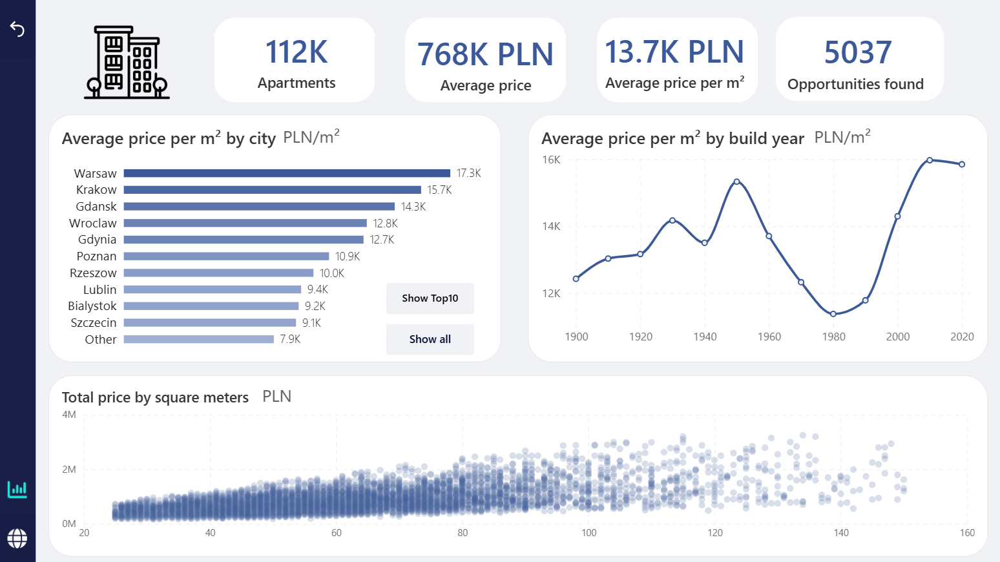

# 🏢 Apartment value radar

## Overview
Project combining ML and Power BI to analyze 
the Polish residential real estate market. An XGBoost model estimates 
apartment market value. The difference between predicted and actual 
listing price is used to surface undervalued properties.




https://github.com/user-attachments/assets/685b6fdf-0a21-4a82-82ce-807cc78e456b


## Project structure

**Stage 1: Modelling (Jupyter Notebook)**  
Data cleaning and EDA, feature engineering and XGBoost training inside 
a Scikit-Learn Pipeline, hyperparameter tuning with Optuna, model validation and
explainability using SHAP.

**Stage 2: Dashboard (Power BI)**  
Interactive dashboard:
- **Page 1 (Market overview):** contains charts of key metrics: price per sq meter by city, pricing trends by build year, and area vs. price distributions.
- **Page 2 (Opportunity map):** interactive Azure Map with clustering. 
  Clicking a listing shows model price, actual price, and estimated profit

## Key findings (SHAP)


* **`squareMeters`:** Living area is the dominant feature, where larger apartments heavily increase predicted prices and smaller ones drag them down.
* **`city`:** Engineered using target encoding. The plot shows that markets with high historical average prices (red) act as strong positive multipliers, while more affordable markets (blue) reduce the predicted price.
* **`centreDistance`:** Proximity to the central business district commands a clear premium, shown by low distances (blue) pushing prices up and high distances (red) reducing them.
* **`buildYear`:** Newer construction dates (red) slightly increase the predicted value.

## Model performance
| Metric | Value |
|--------|-------|
| MAE | 63.2K PLN |
| MAPE | 8% |
| Relative RMSE | 14.11%|


## Tech stack
Pandas, Scikit-Learn, XGBoost, Optuna, SHAP, Power BI, DAX, Azure Maps

## Repository structure
```
├── 
README.md
```
